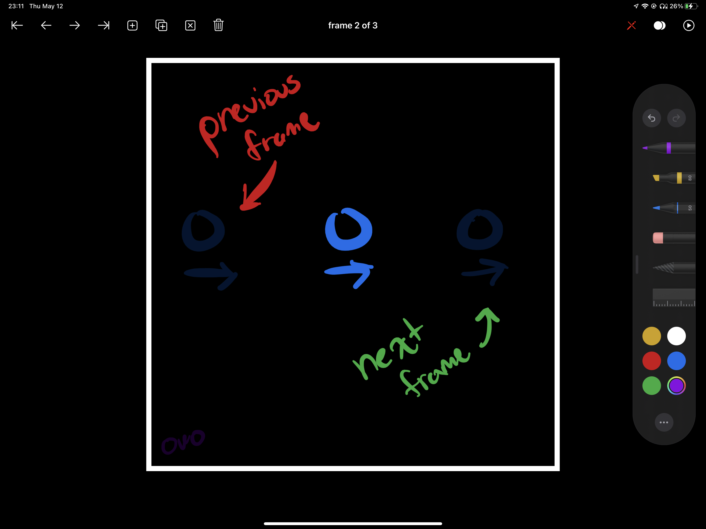

# rosette

a simple flipbook animation app for iPad

## features

- drawing via PencilKit
- navigating to first, last, next, and previous frame
- navigation can be done with swipe gestures!!!
- if you swipe past the last frame, it will create a new frame for you :)
- inserting/deleting frames
- duplicating/clearing frames
- **onion skinning!** this allows the user to see a low-opacity version of the
  previous frame and the next frame so that they can animate between two frames
  effectively.
- play/pause the animation preview
- manage the conditions under which a given control is enabled
- a toggle for drawing with finger
  - 
  - NOTE: YOU WILL NEED THIS IN ORDER TO TEST THE APP IN AN IPAD SIMULATOR. the icon a pencil with a slash through it. it should turn green when finger drawing is enabled. this will disable gesture navigation. if you want to test gestures, you need to turn this off again.
